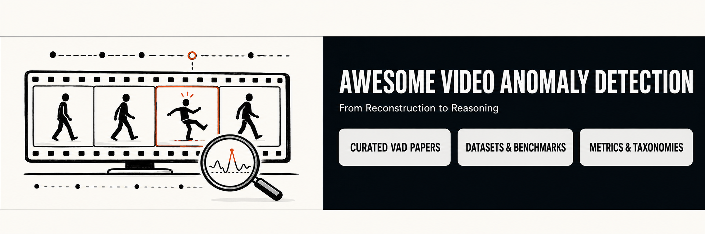

# Awesome Video Anomaly Detection

[](https://doi.org/10.5281/zenodo.22230731)
[](https://github.com/Saba003/Awesome-Video-Anomaly-Detection/releases/latest)
[](LICENSE)
[](https://github.com/Saba003/Awesome-Video-Anomaly-Detection/stargazers)
[](https://github.com/Saba003/Awesome-Video-Anomaly-Detection/graphs/contributors)
[](https://github.com/Saba003/Awesome-Video-Anomaly-Detection/issues)
[](https://github.com/Saba003/Awesome-Video-Anomaly-Detection/commits/main)

Official companion repository for the review:

> **From Reconstruction to Reasoning: The Evolution of Deep Learning Architectures for Video Anomaly Detection**

<p align="center">
  
</p>

The manuscript is currently under review/preparation. Its public preprint and publication links will be added here when available.

This repository provides a curated and reproducible resource for deep learning-based video anomaly detection (VAD), including paper metadata, benchmark results, dataset summaries, taxonomies, systematic-review material, deployment guidance, and analysis scripts.

## Scope

The repository covers:

- Supervised, semi-supervised, weakly supervised, self-supervised, unsupervised, and training-free VAD
- CNNs, RNNs, autoencoders, GANs, transformers, multimodal systems, vision-language models, and LLM-assisted reasoning
- Benchmark datasets and evaluation metrics
- Explainability, privacy, deployment constraints, and ethical considerations
- Practitioner-oriented model selection guidance

## Repository structure

```text
paper/                 Manuscript and citation material
data/                  Structured paper, dataset, metric, and benchmark records
taxonomy/              Supervision, architecture, deployment, and XAI taxonomies
resources/             Curated topic-specific documentation
figures/               Editable and export-ready figures
analysis/              Scripts and notebooks for trend and benchmark analysis
systematic_review/     Search protocol, screening, and quality assessment
practitioner_guide/    Decision support for model, dataset, and metric selection
templates/             Templates for new entries and contributions
docs/                  Documentation pages
.github/               Issue templates and automation workflows
```

## Quick start

```bash
python -m venv .venv
source .venv/bin/activate
pip install -r requirements.txt
python analysis/scripts/validate_entries.py
python analysis/scripts/generate_tables.py
python analysis/scripts/generate_figures.py
```

## Core data files

- `data/papers_master.csv`: paper-level metadata
- `data/benchmarks.csv`: one row per paper-dataset-metric result
- `data/datasets.csv`: dataset properties
- `data/metrics.csv`: metric definitions and cautions
- `data/methods.csv`: method taxonomy
- `data/venues.csv`: venue tracking

## How to contribute

Please read [CONTRIBUTING.md](CONTRIBUTING.md). You may propose:

- A missing paper
- A corrected benchmark result
- A new dataset
- A taxonomy improvement
- A broken link or metadata correction

## Citation

If this repository, its curated records, or its taxonomies support your work, please cite the companion review. Citation metadata is available in [CITATION.cff](CITATION.cff), and a ready-to-use BibTeX entry is provided in [paper/citation.bib](paper/citation.bib). Please update the entry from the public preprint or publisher page once the paper is published.

## Relationship to the paper

This repository is the living companion resource for the review. It provides the structured records, review protocol, taxonomies, extended documentation, and practitioner guidance underlying and extending the manuscript. Because the repository may evolve after publication, use a tagged release or archived DOI when citing a fixed version.

## License

Code is released under the MIT License. Curated tables and documentation may be reused with attribution. The manuscript remains subject to the final publisher policy.

## Contributors

We gratefully acknowledge everyone who has contributed to the development and maintenance of this resource.

<a href="https://github.com/Saba003/Awesome-Video-Anomaly-Detection/graphs/contributors">
  
</a>

Contributions of all kinds are welcome. Please see our [contribution guidelines](CONTRIBUTING.md) to report missing papers, add datasets, correct benchmark results, or improve the documentation.
